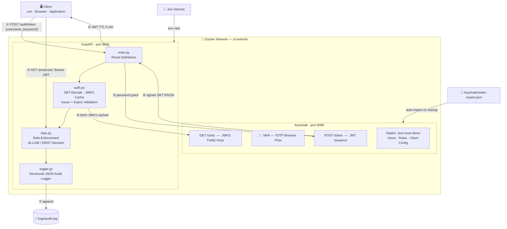

# Zero Trust Access Framework

A practical Zero Trust Access Framework for cloud-native regulated infrastructure.
Demonstrates centralized identity, SSO, MFA, RBAC, JWT validation, secrets management,
and structured audit logging — mapped to enterprise tools used in healthcare, banking,
and critical infrastructure environments.

## Project Brief

This project addresses the failure of perimeter-based security models. Real-world incidents
(SolarWinds, Uber, LastPass) showed that once credentials are stolen, implicit trust inside
a network leads to lateral movement and privilege escalation. This framework implements
**Zero Trust**: every request is verified regardless of origin, roles are enforced per endpoint,
and every access decision is permanently logged.

**Full project report:** [docs/project-report.md](docs/project-report.md) — includes brainstorm,
timeline, AI prompts used, and lessons learned.

**Security research:** [docs/vulnerability-research.md](docs/vulnerability-research.md) — CVE
analysis, OWASP mapping, accepted risks.

**Threat model:** [docs/threat-model.md](docs/threat-model.md) — STRIDE analysis, attack surface
map, defense layers, production hardening roadmap.

## Architecture



Full diagrams (auth flow, RBAC decision tree, role matrix, token lifecycle): [docs/architecture.md](docs/architecture.md)

Full testing analysis (error analysis, edge cases, all 26 test cases): [docs/testing-analysis.md](docs/testing-analysis.md)

## Stack

| Component | Technology | Enterprise Equivalent |
|---|---|---|
| Identity Provider | Keycloak 24 | Okta, Azure AD |
| Auth Protocol | OpenID Connect / JWT | Same |
| MFA | Keycloak OTP | Okta MFA, Duo |
| Protected API | FastAPI (Python) | Any backend |
| Policy Enforcement | FastAPI middleware | OPA, Envoy |
| Secrets | `.env` → Vault pattern | HashiCorp Vault, AWS Secrets Manager |
| Audit Logging | JSON to file | Splunk, ELK, OpenSearch |
| Container Orchestration | Docker Compose | Kubernetes |

## Users and Roles

| Username | Role | Password |
|---|---|---|
| `alice.admin` | `admin` | `Admin@1234` |
| `bob.developer` | `developer` | `Dev@1234` |
| `sara.auditor` | `security-auditor` | `Audit@1234` |
| `ron.readonly` | `readonly` | `Read@1234` |

## Access Control Matrix

| Endpoint | admin | developer | security-auditor | readonly |
|---|:---:|:---:|:---:|:---:|
| `GET /health` | ✅ | ✅ | ✅ | ✅ |
| `GET /admin/dashboard` | ✅ | ❌ | ❌ | ❌ |
| `GET /developer/api` | ✅ | ✅ | ❌ | ❌ |
| `GET /monitoring/dashboard` | ✅ | ❌ | ✅ | ✅ |
| `GET /security/audit` | ✅ | ❌ | ✅ | ❌ |

## Quick Start

### Prerequisites

- Docker Desktop (running)
- Docker Compose v2+
- `curl` and `jq` (for testing)

### 1. Clone and configure

```bash
git clone https://github.com/GaganSingh11/zero-trust-access-framework.git
cd zero-trust-access-framework
cp .env.example .env
```

### 2. Start the stack

```bash
docker compose up --build -d
```

Wait ~60 seconds for Keycloak to import the realm, then verify:

```bash
curl http://localhost:8000/health
# {"status": "ok", "service": "zt-platform-api"}
```

### 3. Get a token

```bash
TOKEN=$(curl -s -X POST http://localhost:8000/auth/token \
  -H "Content-Type: application/json" \
  -d '{"username":"alice.admin","password":"Admin@1234"}' | jq -r .access_token)
```

### 4. Call a protected endpoint

```bash
curl -H "Authorization: Bearer $TOKEN" http://localhost:8000/admin/dashboard | jq
```

### 5. Run the full access matrix test

```bash
bash scripts/test_access.sh
```

### 6. View audit logs

```bash
cat logs/audit.log | jq
```

### 7. Interactive API docs

Open [http://localhost:8000/docs](http://localhost:8000/docs) in your browser.
Click **Authorize**, paste a Bearer token, and test protected routes.

### 8. Keycloak admin console

Open [http://localhost:8080](http://localhost:8080) — username: `admin`, password: `admin`

## MFA (Browser Login)

MFA via TOTP is configured in the Keycloak browser flow:

1. Open `http://localhost:8080/realms/zero-trust-demo/account`
2. Log in as any test user
3. You will be prompted to configure an OTP device (Google Authenticator / Authy)
4. On subsequent browser logins, the OTP code is required

For API/machine-to-machine flows, the direct grant bypasses browser MFA — this is the
standard pattern for service-to-service token issuance.

## Project Structure

```
zero-trust-access-framework/
├── app/
│   ├── Dockerfile
│   ├── requirements.txt
│   ├── main.py          # FastAPI routes (public + protected)
│   ├── auth.py          # JWT validation against Keycloak JWKS
│   ├── rbac.py          # Role-based access control middleware
│   └── logger.py        # Structured JSON audit logger
├── keycloak/
│   └── realm-export.json  # Pre-configured realm (users, roles, client, MFA)
├── docs/
│   ├── architecture.md            # System design and request flow (5 Mermaid diagrams)
│   ├── access-control-matrix.md   # RBAC matrix + enterprise tool mapping
│   ├── demo-flow.md               # Step-by-step demo commands
│   ├── project-report.md          # Full report: brainstorm, timeline, AI prompts, lessons learned
│   ├── vulnerability-research.md  # CVE analysis, OWASP mapping, accepted risks
│   ├── threat-model.md            # STRIDE model, attack surface map, defense layers
│   └── testing-analysis.md        # Test plan, error analysis, all 26 test cases
├── scripts/
│   └── test_access.sh   # Automated test: 26 cases including edge cases + tampered tokens
├── logs/                # Audit log output (git-ignored)
├── docker-compose.yml
├── .env.example
└── README.md
```

## Zero Trust Principles

| Principle | Implementation |
|---|---|
| Never trust, always verify | Every request requires a valid JWT — no implicit trust |
| Least privilege | Each role accesses only what it needs |
| Verify explicitly | JWT validated against Keycloak's public JWKS on every request |
| Assume breach | All access decisions (ALLOW + DENY) written to audit log |
| Short-lived credentials | Tokens expire in 5 minutes (`accessTokenLifespan: 300`) |

## Audit Log Format

```json
{
  "timestamp": "2026-05-04T10:23:01.123456+00:00",
  "user": "bob.developer",
  "roles": ["developer"],
  "endpoint": "/admin/dashboard",
  "method": "GET",
  "client_ip": "172.18.0.1",
  "decision": "DENY",
  "reason": "requires one of ['admin']"
}
```

## Enterprise Tool Mapping

| This Project | Enterprise Equivalent |
|---|---|
| Keycloak | Okta, Azure AD / Entra ID, Ping Identity |
| OIDC / JWT | Same protocol used everywhere |
| `.env` secrets | AWS Secrets Manager, HashiCorp Vault, K8s Secrets |
| Audit log (JSON file) | Splunk, ELK Stack, OpenSearch |
| FastAPI RBAC middleware | OPA (Open Policy Agent), Envoy, Kong |
| Docker Compose | Kubernetes + Helm |
| Architecture | Palo Alto Prisma Cloud posture model |

## Security Notes

- `.env` is git-ignored — use HashiCorp Vault or AWS Secrets Manager in production
- JWT audience verification is relaxed for the demo; add a Keycloak audience mapper and enable `verify_aud` for production
- Rotate `KEYCLOAK_CLIENT_SECRET` before any non-local deployment

## Teardown

```bash
docker compose down
```
