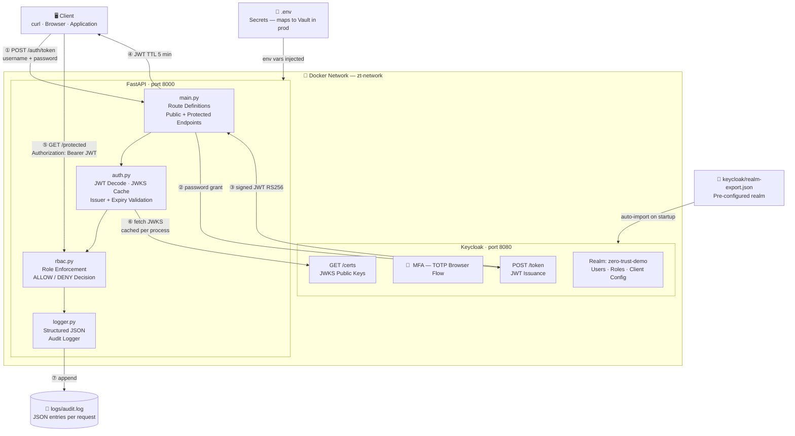
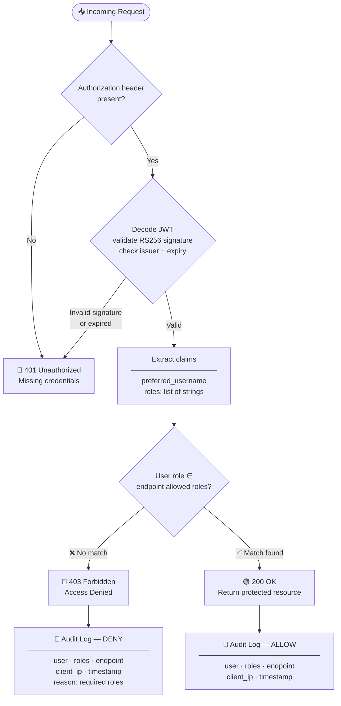
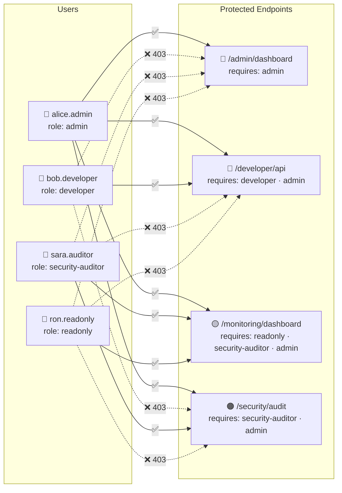
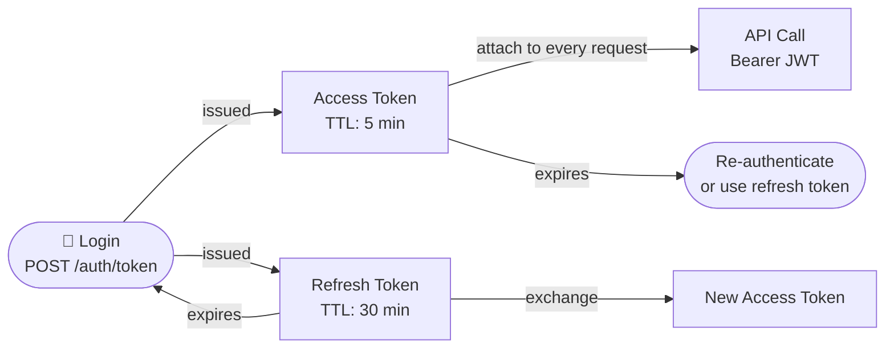

# Architecture

## 1. System Architecture

> All components run inside a Docker bridge network. Only ports 8000 and 8080 are exposed to the host.



---

## 2. Authentication & Access Request Flow

> Step-by-step sequence for every protected API call.

```mermaid
sequenceDiagram
    actor Client as 🖥️ Client
    participant API  as FastAPI  :8000
    participant KC   as Keycloak  :8080
    participant JWKS as JWKS Cache (in-process)
    participant LOG  as logs/audit.log

    rect rgb(220, 240, 255)
        Note over Client,LOG: ── Phase 1 · Authentication ──
        Client->>API: POST /auth/token<br/>{ username, password }
        API->>KC: POST /realms/zero-trust-demo/protocol/openid-connect/token<br/>grant_type=password · client_id · client_secret
        KC-->>API: 200 OK  { access_token, refresh_token, expires_in: 300 }
        API-->>Client: JWT  (RS256, signed by Keycloak)
    end

    rect rgb(220, 255, 230)
        Note over Client,LOG: ── Phase 2 · Authorized Access ──
        Client->>API: GET /admin/dashboard<br/>Authorization: Bearer &lt;JWT&gt;
        API->>JWKS: fetch /realms/zero-trust-demo/protocol/openid-connect/certs
        JWKS-->>API: RSA public keys (cached after first request)
        Note over API: Validate signature · issuer · expiry<br/>Extract preferred_username + roles claim
        Note over API: role "admin" ∈ allowed_roles ✅
        API->>LOG: { user, roles, endpoint, ip, decision: ALLOW }
        API-->>Client: 200 OK  { endpoint, user, roles, message }
    end

    rect rgb(255, 230, 220)
        Note over Client,LOG: ── Phase 3 · Denied Access ──
        Client->>API: GET /admin/dashboard<br/>Authorization: Bearer &lt;developer JWT&gt;
        API->>JWKS: (cache hit — no network call)
        JWKS-->>API: RSA public keys
        Note over API: role "developer" ∉ allowed_roles ❌
        API->>LOG: { user, roles, endpoint, ip, decision: DENY, reason }
        API-->>Client: 403 Forbidden  { detail: "Access denied. Required: ['admin']" }
    end

    rect rgb(255, 245, 200)
        Note over Client,LOG: ── Phase 4 · Invalid / Expired Token ──
        Client->>API: GET /admin/dashboard<br/>Authorization: Bearer &lt;expired or tampered&gt;
        Note over API: JWTError — signature invalid or token expired
        API-->>Client: 401 Unauthorized<br/>WWW-Authenticate: Bearer
    end
```

---

## 3. RBAC Decision Flow

> What happens inside `rbac.py` on every protected request.



---

## 4. Role Access Matrix



---

## 5. Token Lifecycle



---

## Component Responsibilities

| Component | File | Responsibility |
|---|---|---|
| API entrypoint | `app/main.py` | Route definitions, public + protected endpoints |
| Token validation | `app/auth.py` | JWKS fetch + cache, JWT decode, issuer/expiry check |
| Access control | `app/rbac.py` | Role enforcement, ALLOW/DENY decision, triggers logger |
| Audit logging | `app/logger.py` | Structured JSON to console and `logs/audit.log` |
| Identity provider | Keycloak | Users, roles, SSO, MFA, OIDC token issuance |
| Realm config | `keycloak/realm-export.json` | Pre-configured realm, clients, users, MFA flow |
| Secrets | `.env` | Runtime config — maps to HashiCorp Vault or K8s Secrets in prod |

## MFA Behaviour

| Login Method | MFA Triggered | Use Case |
|---|---|---|
| Browser → Keycloak UI | ✅ Yes — TOTP required | Human user login |
| API → `POST /auth/token` | ❌ No — direct grant bypasses browser flow | M2M, CI/CD, service accounts |

This is intentional. In production, human users authenticate through the Keycloak browser flow (with MFA enforced). Service accounts and API clients use client credentials or direct grants — standard practice for regulated infrastructure.
