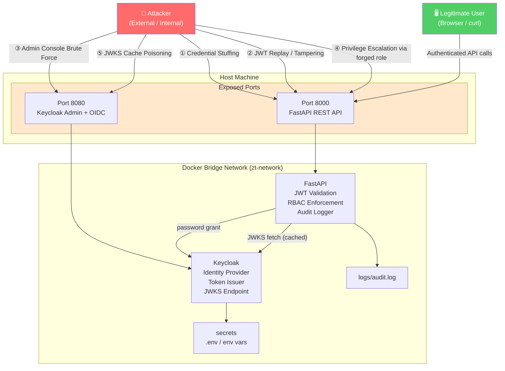

# Threat Model

## 4a. What This Project Protects

This framework protects **authenticated access to role-sensitive API endpoints** in a cloud-native
environment. Specifically:

- **Identity integrity** — only verified, Keycloak-issued identities can reach protected endpoints
- **Authorization boundaries** — roles determine what each identity is permitted to do
- **Audit trail** — every access decision (allow and deny) is permanently logged
- **Secrets** — client credentials and configuration are not hardcoded or exposed in source

The system models a regulated-infrastructure API gateway: the kind used in healthcare, banking,
and critical infrastructure to gate access to admin consoles, developer tooling, monitoring
dashboards, and security audit logs.

---

## 4b. Attack Surface Map

### Exposed Entry Points

| Surface | Port | Protocol | Exposed To | Auth Required |
|---|---|---|---|---|
| FastAPI REST API | 8000 | HTTP | Host / LAN | JWT Bearer (all protected routes) |
| Keycloak Admin Console | 8080 | HTTP | Host / LAN | Keycloak admin credentials |
| Keycloak OIDC Token Endpoint | 8080 | HTTP | Internal (via FastAPI) | client_id + client_secret |
| Keycloak JWKS Endpoint | 8080 | HTTP | Internal (via FastAPI) | None (public key material) |
| Docker Network (`zt-network`) | Internal | Bridge | Container-to-container only | N/A |

### Trust Boundaries

| Boundary | Direction | What Crosses It |
|---|---|---|
| Internet → Host | Inbound | HTTP requests on ports 8000 and 8080 |
| Host → Docker network | Inbound | Forwarded connections only |
| FastAPI → Keycloak | Internal | Password grant, JWKS fetch |
| FastAPI → Filesystem | Write | Audit log entries |
| `.env` → FastAPI | Config | Client secret, realm name, URLs |

---

## 4d. Threats Identified

Using the STRIDE model:

| # | Category | Threat | Target | Likelihood | Impact | Mitigated? |
|---|---|---|---|---|---|---|
| T1 | **S**poofing | Credential stuffing / brute force on `/auth/token` | Keycloak login | Medium | High | Partial — Keycloak brute-force protection; no rate limiting on FastAPI proxy |
| T2 | **T**ampering | JWT payload modification (role elevation) | FastAPI RBAC | Low | Critical | ✅ RS256 signature validation rejects any tampered token |
| T3 | **T**ampering | Algorithm confusion (`alg: none` or `alg: HS256`) | JWT validation | Low | Critical | ✅ `algorithms=["RS256"]` hardcoded; no downgrade path |
| T4 | **R**epudiation | Actions taken without audit trail | `logger.py` | Low | High | ✅ Every ALLOW and DENY logged with user, IP, timestamp |
| T5 | **I**nformation Disclosure | Sensitive data leaked in error responses | FastAPI errors | Low | Medium | Partial — FastAPI returns structured errors; stack traces suppressed in prod |
| T6 | **I**nformation Disclosure | Token interception on unencrypted HTTP | Network | Medium | High | ⚠️ HTTP only in demo; production requires TLS termination |
| T7 | **D**enial of Service | JWKS endpoint flooded; cache invalidated | Keycloak / FastAPI | Low | Medium | Partial — in-process JWKS cache prevents per-request network calls |
| T8 | **D**enial of Service | Token endpoint flooded to lock out users | Keycloak | Medium | Medium | Partial — Keycloak brute-force lockout helps; no API-level rate limiting |
| T9 | **E**levation of Privilege | Stolen valid token reused after user revocation | FastAPI | Medium | High | ⚠️ No token revocation endpoint; mitigated by 5-min TTL |
| T10 | **E**levation of Privilege | Keycloak admin panel accessed by attacker | Port 8080 | Medium | Critical | ⚠️ Admin console exposed on same port; production must restrict access |
| T11 | **S**poofing | `.env` secret exfiltration → client impersonation | Keycloak client | Low | High | Partial — `.env` is git-ignored; production uses Vault |

---

## Defense Layers

| Layer | Mechanism | Implemented |
|---|---|---|
| **Identity** | Keycloak OIDC — centralized, SSO-capable identity provider | ✅ |
| **Authentication** | RS256 JWT validation against JWKS on every request | ✅ |
| **MFA** | TOTP browser flow enforced for human users | ✅ |
| **Authorization** | Role-based access control per endpoint (`rbac.py`) | ✅ |
| **Audit / Non-repudiation** | Structured JSON log for every access decision | ✅ |
| **Short-lived credentials** | 5-minute token TTL limits stolen-token window | ✅ |
| **Secrets isolation** | `.env` not in source; maps to Vault in production | ✅ |
| **Network segmentation** | Internal Docker bridge — Keycloak not directly reachable from outside | ✅ |
| **Transport encryption** | HTTP only (demo); TLS required for production | ⚠️ Not in demo |
| **Rate limiting** | Keycloak brute-force detection; no API-level rate limiting | ⚠️ Partial |
| **Token revocation** | Not implemented; mitigated by short TTL | ⚠️ Gap |
| **Intrusion detection** | Audit log provides raw material; no active alerting | ⚠️ Gap |

---

## 4e. Proposed Security Layers (Production Hardening)

The following additions would move this from a proof-of-concept to a production-grade deployment:

### Priority 1 — Must Have

| Enhancement | Implementation | Addresses |
|---|---|---|
| TLS everywhere | Nginx/Caddy reverse proxy with Let's Encrypt or internal CA | T6 (token interception) |
| Restrict Keycloak admin port | Bind port 8080 to `127.0.0.1` only; add network policy | T10 (admin console exposure) |
| API rate limiting | `slowapi` middleware on `/auth/token` (e.g., 10 req/min per IP) | T1, T8 (brute force) |
| JWT audience verification | Add Keycloak audience protocol mapper; enable `verify_aud: True` in `auth.py` | T3 (token misuse) |
| Rotate client secret | Replace `zt-secret-change-me` with a 256-bit random secret | T11 (secret exfiltration) |

### Priority 2 — Should Have

| Enhancement | Implementation | Addresses |
|---|---|---|
| Token revocation endpoint | `/auth/logout` calling Keycloak's revocation endpoint | T9 (stolen token reuse) |
| Secrets management | Replace `.env` with HashiCorp Vault or AWS Secrets Manager | T11 |
| Structured log shipping | Forward `logs/audit.log` to Splunk / ELK / OpenSearch | T4 (audit completeness) |
| Replace `python-jose` | Migrate to `joserfc` (actively maintained, no open CVEs) | CVE-2024-33663 |
| Health check auth | Protect `/health` behind network policy (not public) | T5 (info disclosure) |

### Priority 3 — Nice to Have

| Enhancement | Implementation | Addresses |
|---|---|---|
| Anomaly detection | Alert on >3 DENY events from same IP within 60s | T1, T8 |
| OPA integration | Replace `rbac.py` with Open Policy Agent for policy-as-code | Scalability |
| mTLS between services | Client certificates for FastAPI ↔ Keycloak communication | Network tampering |
| Kubernetes deployment | Replace Docker Compose with Helm chart + NetworkPolicy | Isolation |
| SIEM integration | Ship audit logs with structured fields to Splunk/Sentinel | Incident response |
